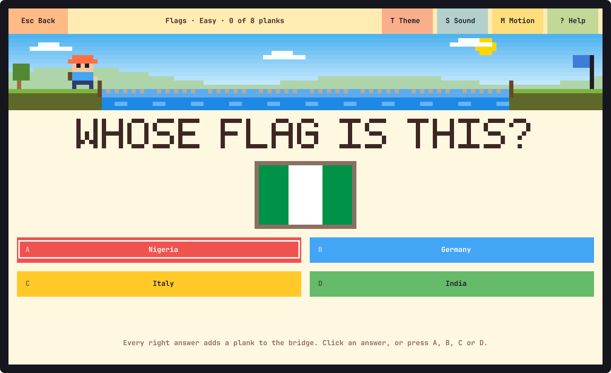

# fungeo

A geography quiz for children, in the terminal, on Linux and macOS.



Every right answer lays a plank of a bridge. Eight planks and the explorer walks
across the river, the confetti falls, and the round earns up to three stars in the
passport.

- **Four kinds of question, and a mix of them all:** countries and capitals, flags
  (65 of them, drawn on the screen), nature (oceans, rivers, mountains, animals) and wonders
  (famous places, languages, food).
- **Three levels:** easy for early readers, medium for about 8 to 10, hard for 11
  to 13. More than 450 questions in all, each with something worth knowing shown
  after the answer. They come in a different order every time, and a second round of
  the same square brings questions the first did not.
- **Mouse or keyboard, or both at once.** Everything on the screen can be clicked,
  and everything has a key.
- **Big letters.** In a large window the questions and answers are drawn several rows
  tall. A terminal cannot change its own text size, so for the smaller text make the
  window full screen and zoom in (usually `Ctrl` `+`).
- **Kind to a wrong answer.** A plank falls in the river, the right answer is shown,
  and the question comes back later for another try. Nobody loses.
- **Five color themes**, animations, sounds, and an opening with a tune.

## Install

fungeo runs on macOS and Linux, on Intel and ARM. It is a single program with
nothing else to install; the terminal needs UTF-8, which every current one has.

### Homebrew (macOS and Linux)

```sh
brew install anwarahmed/tap/fungeo
```

Update with `brew upgrade fungeo`, remove with `brew uninstall fungeo`.

### Install script

```sh
curl -fsSL https://raw.githubusercontent.com/anwarahmed/fungeo/main/install.sh | sh
```

This downloads the latest release for your machine, checks its checksum, and puts it
in `~/.local/bin` (set `FUNGEO_BIN_DIR` for somewhere else). A copy installed this
way keeps itself up to date (see [Updates](#updates)). Where there is no prebuilt
binary it builds from source instead, which needs Rust. To remove the game:

```sh
curl -fsSL https://raw.githubusercontent.com/anwarahmed/fungeo/main/install.sh | sh -s -- --uninstall
```

### Arch Linux

Each [release](https://github.com/anwarahmed/fungeo/releases/latest) carries a
`PKGBUILD` for the package `fungeo-bin`. Download it into an empty directory and
build:

```sh
curl -fsSLO https://github.com/anwarahmed/fungeo/releases/latest/download/PKGBUILD
makepkg -si
```

Remove it with `sudo pacman -R fungeo-bin`. (The package is not in the AUR yet.)

### From source

Needs Rust 1.88 or newer.

```sh
git clone https://github.com/anwarahmed/fungeo
cd fungeo
cargo run --release
```

`./install.sh --source` builds and installs in one step; `./install.sh --link` links
`~/.local/bin/fungeo` to the checkout's build, for development.

## Updates

| Installed with | How it updates |
| -------------- | -------------- |
| Install script | By itself: when it starts it checks for a newer release, at most once a day, installs it and restarts |
| Homebrew       | `brew upgrade fungeo` |
| Arch package   | Build the newer `PKGBUILD` the same way |
| From source    | `git pull`, then build again |

Only the install script's copy updates itself. A copy that Homebrew or pacman owns is
marked as theirs when it is installed and never touches its own file, and neither does
a build run from a checkout.

For a copy that updates itself:

```sh
fungeo update        # check now and install a newer release
fungeo update off    # stop checking at startup ("on" turns it back on)
```

`FUNGEO_NO_UPDATE=1` skips the check for one run. The check at startup happens at
most once a day (`fungeo update` always checks), waits at most three seconds, and
says nothing when you are offline. An update is verified against the release's
SHA-256 checksum and never moves to an older version; if anything fails, the version
you have starts as usual.

## Play

```sh
fungeo
```

| | Mouse | Keys |
|---|---|---|
| Choose a category and level | click its square | arrows or `H` `J` `K` `L`, then `Enter` |
| Answer | click it | `A` `B` `C` `D` or `1` `2` `3` `4`, or arrows (`H` `J` `K` `L`) and `Enter` |
| Next question | click **Next** | `Enter` or `Space` |
| Back to the passport | click **Back** | `Esc` |
| Theme, sound, motion | click them | `T`, `S`, `M` |
| Help, quit | click them | `?`, `Q` |

Three stars for a bridge built with one mistake or none, two for up to three
mistakes, one for getting across at all. The passport shows the best of each
category and level since the game was started; every start is a fresh passport.

Options: `--theme sunny|ocean|candy|jungle|night`, `--sound on|off`,
`--animations on|off`, `--no-intro`. `fungeo --help` lists everything. The window
needs to be at least 60 columns by 22 rows; big letters appear from about 120 by 36.

Sound needs nothing installed: it is played with `pw-play`, `paplay` or `aplay` on
Linux and `afplay` on macOS, whichever is there.

## Questions of your own

A category is one text file. Put it in `~/.config/fungeo/questions/` (or
`$XDG_CONFIG_HOME/fungeo/questions/`) and it appears in the passport:

```text
name: Our Town
color: #00897b
order: 10

[easy]
Q: Which river runs through our town?
A: The Avon
X: The Nile | The Thames | The Amazon
F: It rises in the hills to the north.

Q: Which country do we live in?
A: England
X: France | Spain | Italy

[hard]
...
```

- `Q` is the question, `A` the right answer, `X` three or more wrong ones (three are
  shown each time), `F` an optional fact for afterwards. Blank lines separate
  questions.
- `[easy]`, `[medium]` and `[hard]` start a level. A level can be played once it
  has four questions; eight or more make a better round.
- `name`, `color` (`#rrggbb`) and `order` (lower is higher up; the built-in ones are
  1 to 4) are optional.
- A flag: `P: flag h red white blue` (stripes top to bottom), `v` (side by side),
  `nordic FIELD CROSS`, `disc FIELD DISC`, `plus FIELD CROSS`, or
  `bar COLOR WIDTH STRIPES...`. `red*2` makes a stripe twice as thick. A star, a
  circle or a triangle at the pole goes on top after a `+`:
  `P: flag h red red + star yellow 30`.
- With an `ask: ...` line at the top, questions may leave out `Q`; and questions
  without `X` use one another's answers as the wrong ones. That is how the flags
  file is written: see [questions/flags.txt](questions/flags.txt).
- A file named like a built-in one (`nature.txt`) replaces it.

`fungeo check` lists every category and says what is wrong with a file, by line.

## Files

| What | Where |
|---|---|
| Settings, generated sound files, the time of the last update check | `~/.local/state/fungeo/` (`$XDG_STATE_HOME`) |
| Your own questions | `~/.config/fungeo/questions/` (`$XDG_CONFIG_HOME`) |

## Development

```sh
cargo test                                   # unit tests
cargo clippy --all-targets -- -D warnings
cargo build --release && tests/e2e.sh        # the built program in tmux, install.sh, the updater
```

[CLAUDE.md](CLAUDE.md) describes how the code is laid out and why, and
[RELEASING.md](RELEASING.md) how a release is made.

## License

MIT. See [LICENSE](LICENSE).
